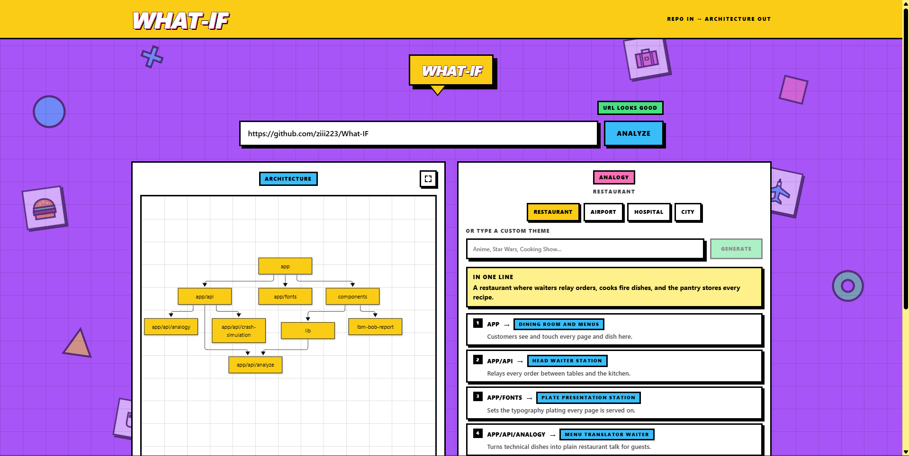

<p align="center">
  
</p>

# WHAT-IF

### Turning complex GitHub repos into high-contrast flowcharts, real-world analogies, and interactive crash simulations.

Paste a public GitHub repo URL. Get a flowchart of how it is actually built, the same structure retold as a story anyone can follow, and the ability to click any part of it and ask *"what if this broke?"*

Built with **IBM Bob** for the lablab.ai hackathon.

---

## The Problem

Product managers, founders and other non-technical stakeholders sit in architecture conversations they cannot independently verify. They get a developer's verbal summary of a codebase, and then have no way to check it, revisit it, or share it. Meanwhile developers re-explain the same system in plain language every single time a non-engineer asks *"so what does this actually do?"*

The result is a permanent translation tax between the people who build software and the people who decide what it should do — and the two sides rarely end up holding the same mental model.

## The Solution

WHAT-IF is **the PM-to-Dev Rosetta Stone**. One URL, three things, all derived from real repo signals:

**1. A flowchart made of the repo's own folders.** Nodes are labelled with real paths copied out of the repository tree (`src/components`, `api`, `lib/utils`) — never invented product or role names. The panel reads as a map of *that* repo, so a newcomer can find the exact code a node names.

**2. The same structure retold as an analogy.** The identical architecture is re-narrated in one of four switchable framings — **Restaurant**, **Airport**, **Hospital**, or **City Grid**. Hovering any diagram node raises a tooltip giving that folder's role in the active theme (`ANALOGY: HEAD WAITER`). Switching themes re-derives the narrative and every tooltip, with no GitHub re-fetch and no re-analysis — the diagram itself never re-renders.

**3. "Simulate System Crash."** Click any node and the model answers *"what happens if this breaks?"* in 2–3 sentences of business-impact narrative, written in the currently active theme. A database node in Restaurant theme: *"The kitchen pantry caught fire — the chef can't prepare anything until suppliers bring raw ingredients, and service grinds to a halt."*

Every analysis also carries an **onboarding-friction verdict** (`low` / `moderate` / `high`) with a one-line reason, generated in the same round trip as the diagram — so the output is not just "here's a diagram" but "here's a judgment a PM can act on."

Because the diagram and the narrative are kept in lockstep, a PM and an engineer can point at the same node and mean the same thing.

### How it works

```
GitHub URL  →  /api/analyze           →  { mermaidCode, architecture[], verdict }
            →  /api/analogy           →  { mapping[], narrative }   (cached architecture, no re-fetch)
            →  /api/crash-simulation  →  { impact }                (one node, active theme)
```

The server fetches repo metadata, the file tree, and up to three config files (`package.json`, `docker-compose.yml`, `README.md`), compresses them into a compact `RepoSummary`, and makes a single strict-JSON LLM call. Source files are never read — no AST parsing, no import graphs.

---

## IBM Bob Usage

IBM Bob was the development environment for this project, not a runtime dependency. It was used across three areas the submission calls out:

**Repository parsing.** Bob built and iterated on the ingestion pipeline in `lib/github.ts`, `lib/repoSummary.ts` and `lib/mermaidSanitize.ts` — the GitHub REST fetch layer, the keep/discard rules that decide which tree paths are source code rather than lockfiles, generated artifacts or agent/IDE config, and the sanitizer that guarantees every mermaid string is safe before it reaches the client. Bob also wrote the `/api/analyze` route contract in `ARCHITECTURE.md` §2.1 and the schema-enforcement logic that validates the model's JSON before it returns to the browser.

**Analogy mapping.** Bob implemented the four static analogy framings and the prompt builders in `lib/analogyPrompts.ts`, plus the vocabulary-consistency rule that keeps the diagram tooltips and the narrative panel using the same role names for the same folder. The theme-switch path (`/api/analogy` reusing cached `architecture[]` with no GitHub round trip) was designed and built in Bob sessions.

**Crash diagnostics.** Bob built `/api/crash-simulation` and the inline `CrashSimulationCard` — the node-click interaction, the pending-node handling, and the rule that failure inside the crash card stays inside the crash card rather than escalating to a page-level error.

Bob's workspace instructions live in **`BOB.md`**, with the agent role split in **`AGENTS.md`**, the build sequence in **`BUILD_STRATEGY.md`**, and the hard rules in **`RULES.md`**. Bob's task session screenshots and exported logs are in **`ibm-bob-report/`**.

---

## Quickstart

**Requirements:** Node.js 18+ and npm. No database, no auth, no GitHub token.

```bash
# 1. Install
npm install

# 2. Configure — copy the template and add your key
cp .env.example .env.local
#    then set DEEPSEEK_API_KEY=sk-...   (https://platform.deepseek.com/api_keys)

# 3. Run
npm run dev
```

Open **http://localhost:3000**, paste a public repo URL such as `https://github.com/vercel/next.js`, and click **Analyze**.

| Command | What it does |
|---|---|
| `npm run dev` | Start the dev server on `localhost:3000` |
| `npm run build` | Production build |
| `npm start` | Serve the production build |
| `npm run lint` | ESLint via `next lint` |

`DEEPSEEK_API_KEY` is the only required variable. The app starts without it, but every route fails with `upstream_error`.

---

## Project Structure

```
app/
  layout.tsx  page.tsx  globals.css
  api/analyze/route.ts             # repo → mermaidCode + architecture[] + verdict
  api/analogy/route.ts             # cached architecture[] → themed narrative + mapping
  api/crash-simulation/route.ts    # one node + active theme → impact narrative
components/
  RepoInputForm  AnalysisPanel  FlowchartView
  AnalogyPanel  AnalogySelector  CrashSimulationCard
  FloatingShapes  OrbsLoader
lib/
  github  repoSummary  mermaidSanitize  analogyPrompts  llm  diagramTheme  types
```

**Stack:** Next.js 14 (App Router) · TypeScript (strict) · Tailwind CSS 3 · Mermaid 12 (client-rendered) · DeepSeek via an OpenAI-compatible endpoint.

## Scope

Public repos only. No accounts, no saved history, no private repos, no GitHub OAuth, no database, no editing or exporting of diagrams.

---

*Documentation: [`PRD.md`](PRD.md) · [`ARCHITECTURE.md`](ARCHITECTURE.md) · [`RULES.md`](RULES.md) · [`BUILD_STRATEGY.md`](BUILD_STRATEGY.md) · [`design.md`](design.md) · [`BOB.md`](BOB.md) · [`AGENTS.md`](AGENTS.md)*
